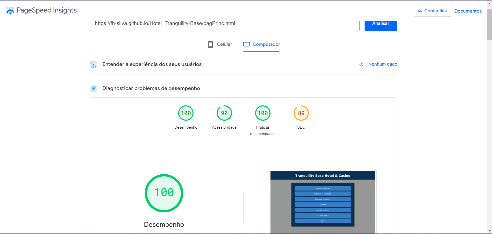

# Hotel Tranquility Base Hotel & Casino

Bem-vindo ao repositório do "Tranquility Base Hotel + Casino"! Este projeto é uma plataforma desenvolvida para aprimorar habilidades em HTML, CSS e JavaScript, proporcionando uma simulação de um sistema interno de gestão de hotel.

Funcionalidades:

- Reserva de quartos para hóspedes;
- Cadastro de hóspedes com cobrança baseada na idade (acima de 6 anos paga o valor inteiro e acima de 65 anos, paga metade);
- Funcionários podem buscar nomes de hóspedes registrados e listar todos os nomes cadastrados (exibe os nomes enviados no momento de fazer a reserva e cadastros);
- Possibilidade de alugar auditórios para empresas externas (exibe o valor a ser pago, a quantidade de garçons necessários para o evento e o que será necessário para o buffet, com base na quantidade de convidados e duração do evento);
- Sistema auxilia na localização do melhor posto para abastecer o carro do hotel (compara o melhor valor e exibe para o usuário);
- Cálculos automatizados e aplica desconto, se passar pelo requisito, para o valor a ser cobrado de empresas contratadas para manutenção do ar-condicionado.

